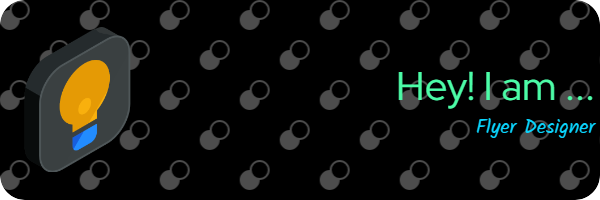

 

<h1 align="left">Hi, I am Shreyas Adiga</h1>

###

 

🎨 Flyer Designer | 💻 MCA Student at KSOU 🎓 BCA Graduate from Seshadripuram Degree College  I'm passionate about designing visually appealing flyers and exploring the world of software development. Currently pursuing my Master of Computer Applications (MCA) from Karnataka State Open University (KSOU), I aim to blend creativity with technology to build innovative digital solutions.

###

<h3 align="left">Backend Tech</h3>

###

  
  
  
  
  
  
  

###

<h3 align="left">Frontend Tech</h3>

###

###

  
  
  
  
  

###

<h3 align="left">Libraries</h3>

###

  
  
  

###

<h3 align="left">Designing Tool</h3>

###

  
  
  

###

 

  
  
  

### ✍️ Random Dev Quote

<!-- Proudly created with GPRM ( https://gprm.itsvg.in ) -->

